# Computational-Neurodynamics-25-Coursework

## Structure and dependencies

We decided to create a class that represents a modular network of Izhikevich neurons, as there are many parameters that are shared between functions. We divided the code into several private methods and helper functions to improve readability and reusability. The public methods are `generate_modular_network`, to create the basic network structure; `run_simulation`, to simulate the behaviour of the network over time, and all the different necessary plotting functions. An overview of the class attributes and methods goes as follows:
- **Attributes:**
  - `p`: rewiring probability for the small-world network.
  - `params`: dictionary containing all the parameters for the simulation. They are unpacked to class attributes. These parameters are:
    - `NUMBER_OF_MODULES`: number of modules in the network.
    - `EXCITATORY_PER_MODULE`: number of excitatory neurons per module.
    - `INHIBITORY_NEURONS`: total number of inhibitory neurons.
    - `CONNECTIONS_PER_MODULE`: number of connections per module.
    - `excitatory_iz_neuron`: parameters for excitatory Izhikevich neurons, containing `a`, `b`, `c`, `d` and their respective noise values `a_r`, `b_r`, `c_r`, `d_r`.
    - `inhibitory_iz_neuron`: parameters for inhibitory Izhikevich neurons, containing `a`, `b`, `c`, `d` and their respective noise values `a_r`, `b_r`, `c_r`, `d_r`.
  - `network`: adjacency matrix representing the connections between neurons. It is created in the `generate_modular_network` method.
  - `W`: connectivity matrix with synaptic weights between neurons. It is created in the `generate_modular_network` method.
  - `D`: delay matrix with synaptic delays between neurons. It is created in the `generate_modular_network` method.
- **Methods:**
  - `__init__(self, p: float, params: dict)`: constructor method that initializes the class attributes. It takes the rewiring probability `p` and a dictionary of parameters `params` as input.
  - `_generate_neuron_parameters(self) -> tuple[np.ndarray, np.ndarray, np.ndarray, np.ndarray]`: private method that generates the parameters for each neuron in the network, adding some noise to the base parameters. It returns four arrays: `a`, `b`, `c`, and `d`.
  - `_generate_ee_connections(self) -> list[tuple[int, int]]`: private method that creates excitatory-excitatory connections using the Watts-Strogatz small-world model. It returns a list of tuples representing the connections.
  - `_generate_ei_connections(self)`: private method that creates excitatory-inhibitory connections.
  - `_generate_ie_connections(self)`: private method that creates inhibitory-excitatory connections.
  - `_generate_ii_connections(self)`: private method that creates inhibitory-inhibitory connections.
  - `_rewire_ee_connections(self) -> int`: private method that rewires the excitatory-excitatory connections based on the rewiring probability `p`. It returns the number of connections that were rewired.
  - `generate_modular_network(self) -> IzNetwork`: public method that generates the modular network by calling the private methods to create connections and rewiring, using the provided IzNetwork class. It returns the instance of IzNetwork that is created.
  - `run_simulation(self, sim_time: int) -> list[tuple[int, int]]`: public method that simulates the network dynamics over a specified simulation time `sim_time`. It returns a list of tuples representing the spike times and neuron indices.

  

## Plots

### Connection Matrices

<table>
<tr>
<td></td>
<td>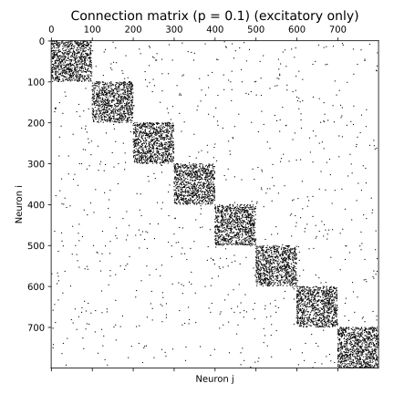</td>
<td>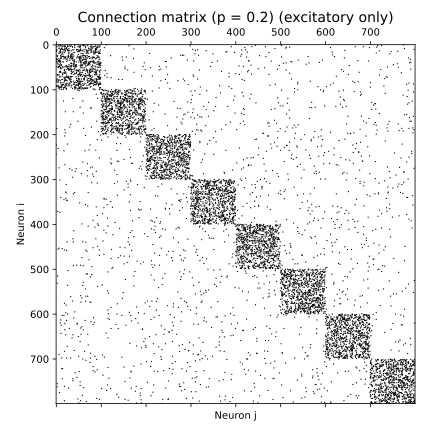</td>
</tr>
<tr>
<td>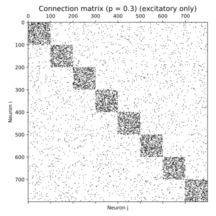</td>
<td></td>
<td>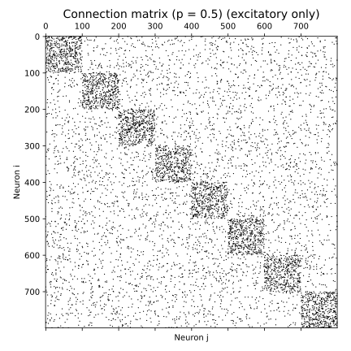</td>
</tr>
</table>

### Raster Plots

<table>
<tr>
<td>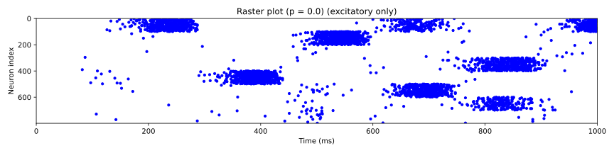</td>
<td>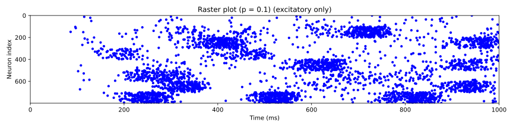</td>
<td>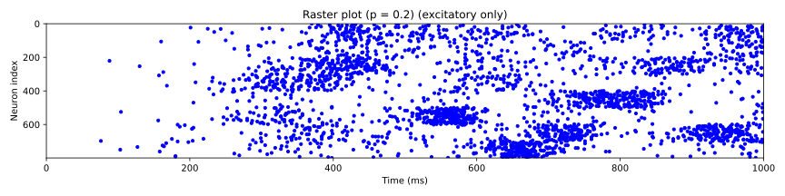</td>
</tr>
<tr>
<td>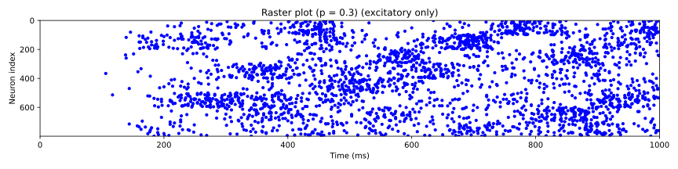</td>
<td>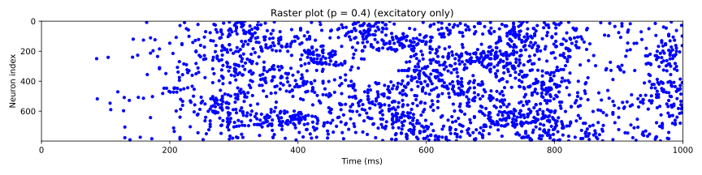</td>
<td>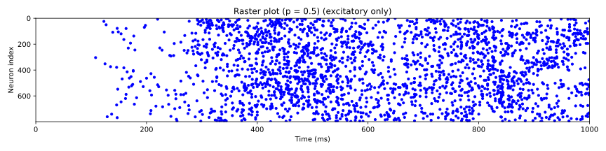</td>
</tr>
</table>

### Mean Firing Rates

<table>
<tr>
<td>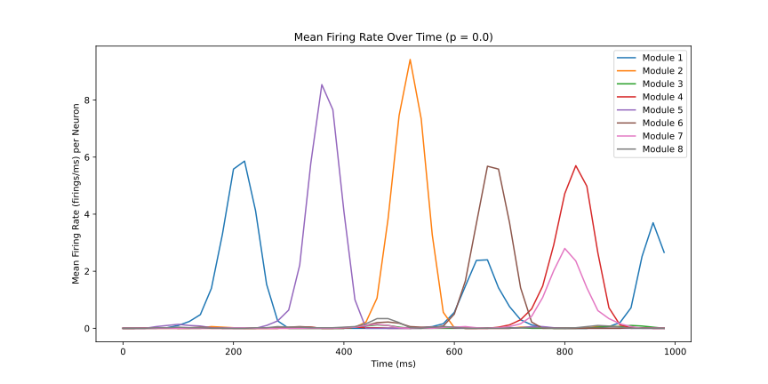</td>
<td>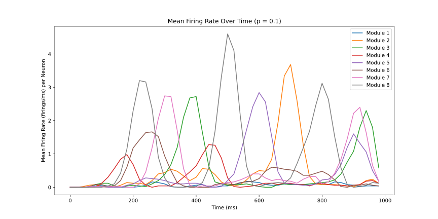</td>
<td></td>
</tr>
<tr>
<td>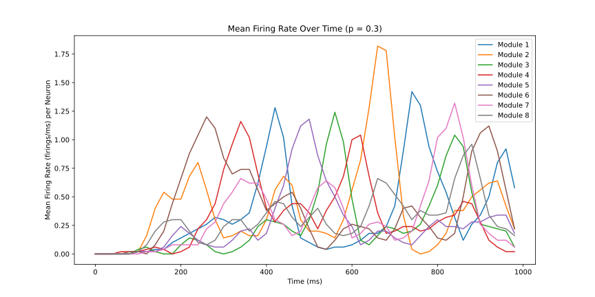</td>
<td>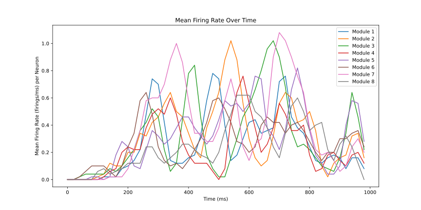</td>
<td>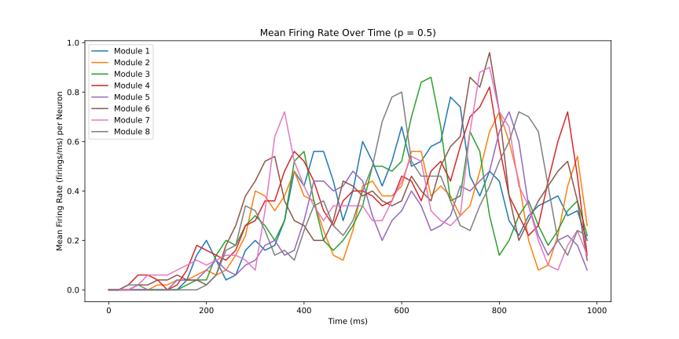</td>
</tr>
</table>
